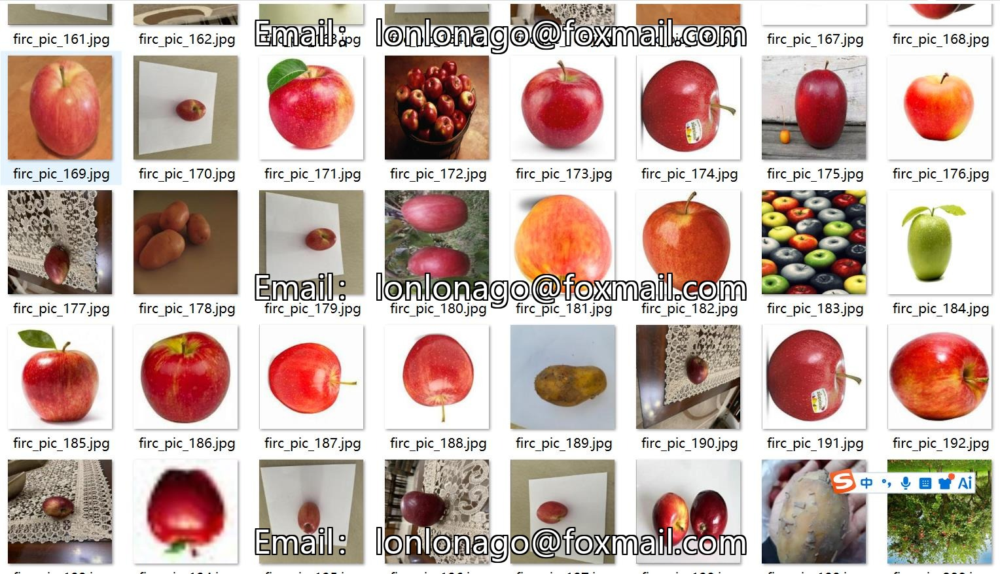
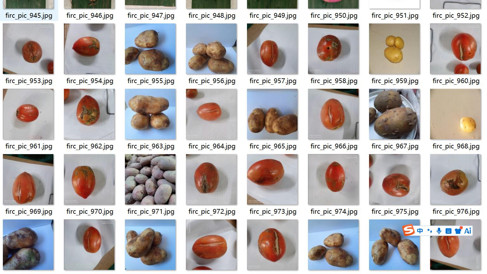
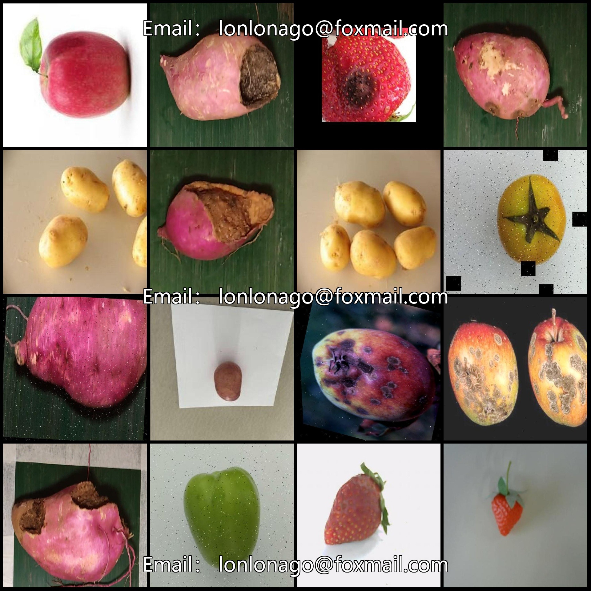
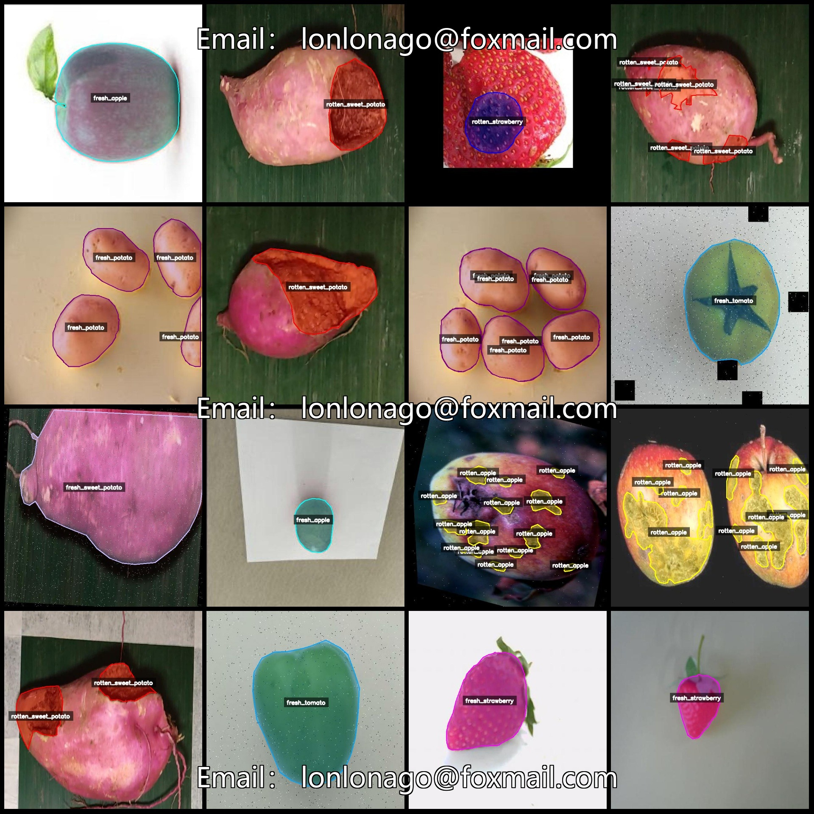
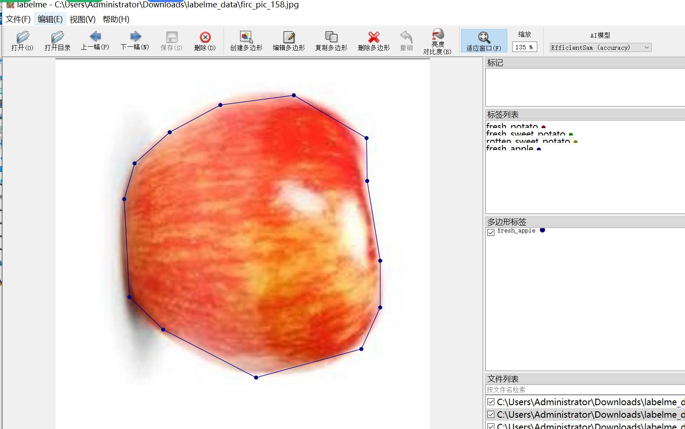

# Five Fresh and Rotten Vegetables and Fruits Identification and Segmentation Dataset in LabelMe format, 1131 Categories

Note: Some of the dataset images have been enhanced.

Dataset format: LabelMe format (without mask files, only containing jpg images and corresponding json files).
Number of images (number of jpg files): 1131
Number of annotations (json file counts): 1131
Number of categories: 10
Category names: ["fresh_apple", "fresh_potato", "fresh_strawberry", "fresh_sweet_potato", "fresh_tomato", "rotten_apple", "rotten_potato", "rotten_strawberry", "rotten_sweet_potato", "rotten_tomato"]
Number of bounding box counts for each category:
fresh_apple = 250
Fresh Potatoes (449)
fresh_strawberry (fresh strawberry) count = 172
Fresh sweet potatoes (fresh sweet potato) count = 130
The fresh tomato count is 100.
rotten_apple count = 463
rotten_potato count = 969
rotten_strawberry count = 180
rotten_sweet_potato count = 210
rotten_tomato count = 32
Total bounding boxes: 2955

Annotation tool used: labelme=5.5.0
Image resolution: 640x640
Annotation rules: Polygons are drawn around categories
Important Note: The dataset can be opened and edited using labelme; json dataset needs to be converted into either mask or Yolo format or COCO format for instance segmentation or instance 
segmentation.
Special Remark: This dataset does not guarantee any accuracy in the trained model or weight files.
Image preview:
Annotation example:
Original images (randomly selected 16 images):
Annotation drawing results:
## Images

Here is a pay link on Stripe ( https://buy.stripe.com/3cs8yP7sY87d0vu9AB ). Please contact me lonlonago@foxmail.com after funding $89, and I will send you a complete data files , thank you!

